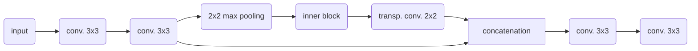

# UNet for detecting suspected marine debris

This repository implementes a neural network with the strucure of the UNet to segment pixels of a Sentinel 2 image to detect among others suspected marine debris. 
It is trained on the [Marine Debris Archive (MARIDA)](https://zenodo.org/records/5151941#.YfFZ_PXP30o)
using the following classes:

 * Marine Debris
 * Dense Sargassum
 * Sparse Sargassum
 * Natural Organic Material
 * Ship
 * Clouds
 * Marine Water (SC)
 * Sediment-Laden Water
 * Foam
 * Turbid Water
 * Shallow Water

The UNet can be configured to an arbitrary depth, but limitied by the input image size and the available GPU memory.
The UNet is composed of blocks with the following recursive structure:



where conv. and trans. conv. are the 2D convolution and transposed convolution respectively.
The inner block is either the identity function (at the deepest level) or a block with the same structure as above.


The weights of the trained network are available at:  https://dox.ulg.ac.be/index.php/s/cPCMw5rjeX5gwTI and are distributed in the [BSON](https://en.wikipedia.org/wiki/BSON) format.
The trained neural network is integrated into the [POS2IDON](https://github.com/AIRCentre/POS2IDON) pipeline.


## Installation

* You need the julia programming language available at https://julialang.org/downloads/ (the code is tested with julia version 1.8.0 and 1.10.0 on Linux with an NVIDIA GPU)
* Clone this repo:

```bash
git clone https://github.com/Alexander-Barth/MarineDebrisUNet.jl
```

* Install all dependencies by issuing the following julia commands:

```julia
using Pkg
cd("MarineDebrisUNet.jl")
Pkg.activate(".")
Pkg.instantiate()
```


## Dataset


The environment variable `MARIDA_DATASET` should contain the directory with the
[Marine Debris Archive (MARIDA)](https://zenodo.org/records/5151941#.YfFZ_PXP30o).
If this environment variable is not set, the data set is expected to in `~/Data/MARIDA_dataset`.
The data set must be uncompressed and the training script will expect for example the file `train_X.txt` to be located at
`$MARIDA_DATASET/splits/train_X.txt`.

This can be done using the following shell commands:

```bash
mkdir -p ~/Data/MARIDA_dataset
cd ~/Data/MARIDA_dataset
wget https://zenodo.org/records/5151941/files/MARIDA.zip
unzip MARIDA.zip
```

## Source code

The main scripts are in the `src` directory:

* `litter_classification_train.jl`: train the neural network
* `litter_classification_validate.jl`: validate a single trained neural network
* `litter_classification_post.jl`: post-process several validation statistics of different neural networks
